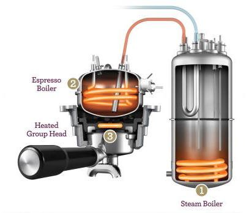

These two points are more indicative of my personal preference and situation, more than anything else. 

There were 2 main drivers for me:
1. Consistency and ease of use
2. Fast heat up time

Consistency and ease of use go hand in hand. The dial-in process requires a ton of time, effort, and (now increasingly expensive...) coffee. Ideally, you dial-in like a science experiment - change one variable and evaluate the output. The machine controls a ton of those variables: temperature of the water, temperature of the group, pressure, water dispersion, among other things. The BDB (not that special for a machine in its price point) is well known to manage all of the above quite consistently from brew to brew. 

The fast heat up time actually broke the tie for me between the BDB and the other machines. Unbelievably, dual boilers that heat up in a reasonable amount of time are few and far between.
This is because home machines, generally borrowing from their commercial counterparts, usually rely on having large boilers to heat up the group head passively or churn water through the group head. These are great at maintaining consistent temps in a relatively 'stupid' and reliable manner, which probably cuts down on Cafe maintenance costs. 
This method is *incredibly* wasteful if you heat up a huge amount of water to brew 1 40ml shot of espresso. 

The BDB is one of few that directly heat the group head electrically - here's the design below (pretty neat). 

The brew boiler (2) heats up relatively quickly because it's small, and the group head (3) is heated directly via a coil. 

I've heard of other machines that do this - like the Bezzra BZ10. But I couldn't find any supply of it anywhere, so I just went with the Breville and I'm pretty happy about my choice.
