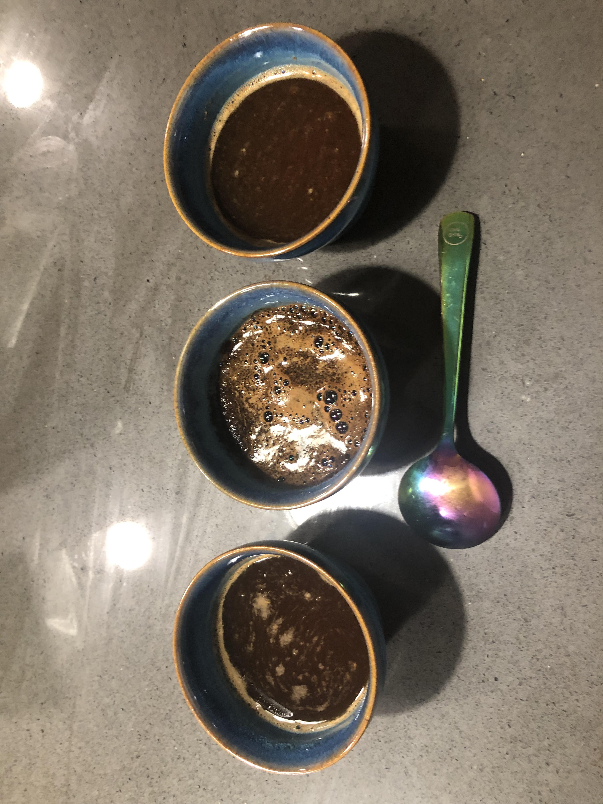
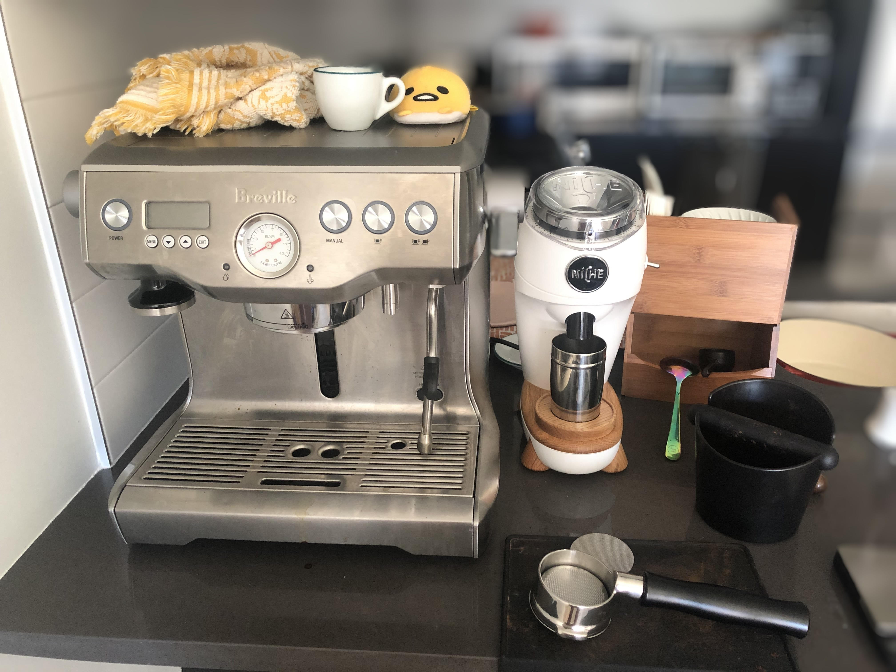

# Coffee Tasting
I'm once again stuck with 3 different mostly-full bags of coffee (basically 2+ months supply) going stale and losing value day by day. Might as well do a comparative tasting!

I tried 3 different coffees today
1. Ethiopian Single Origin from Counter Culture
2. Rwandan Single Origin from Partner's Coffee
3. Costa Rica Single Origin from Peet's Coffee

They're all supposedly light roasts, although the Peet's coffee was clearly a medium or medium-dark by comparison. Not necessarily a bad thing, just more proof that light/med/dark can get pretty subjective from roaster to roaster. 

As for tasting, I used the same framework for tasting (predominant flavor, finish, and texture)

| Item         | Primary Flavor     | Finish | Texture |
|--------------|--------------------|--------| --------|
| Counter Culture Ethiopia | Citrus Fruit? | Basically None | Thin |
| Partner's Coffee Rwanda | Peach? | Long Citrus Fruit | Thin |
| Peet's Costa Rica | Slightly bitter, Citrus | Almost no finish | Thin |

The Rwandan coffee actually smelled a bit like vanilla which was cool. Other coffees smelled pretty "normal". 

If I'm being completely hoenst, I could barely tell the difference between the first two coffees - probably the length of the finish was the most obvious thing to me but the fruit flavors were pretty similar. To me, citrus fruit means a brighter acidity while peach/apple means a more rounded acidity+sweetness. 

# Setup Update
I recently got the Niche Zero. For those not familiar, its main innovation is low retention single dose grinding (meaning you weigh one cup's worth of coffee at a time, put it in the hopper, then grind). Retention is coffee left inside the grinder after you grind through a single dose. Generally, hopper grinders have very high retention - if you change the grind setting, there will be several grams of coffee with the 'old' grind setting. 

Single dosing is popular because it's easier to adjust grind setting between cups without wasting coffee. Even though it's not particularly expensive to waste coffee, it just feels bad and is generally annoying. 

