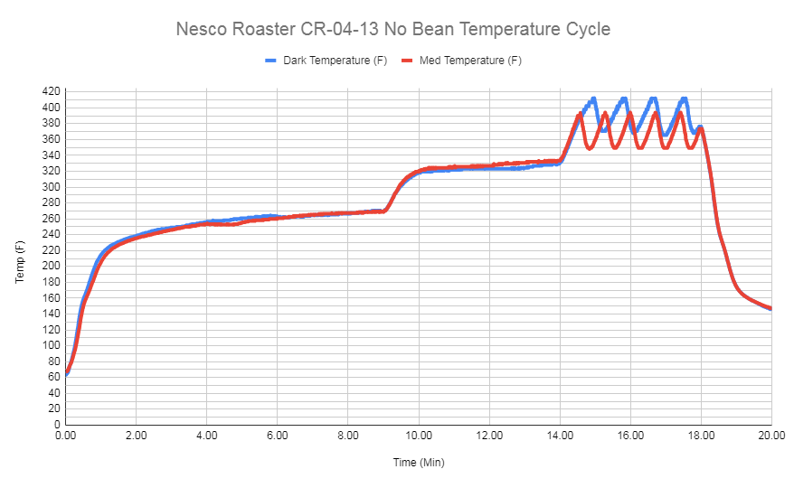

I got a great deal on a Nesco roaster ($45 for an open-box product, normally $80) and figured it would be great value at that price. I’ve used this roaster ~50 times, which should be enough to comment a bit on a very simple machine.

I’ll update this post as I collect more data and learn new things about the roaster.

## Pricing
If you want to buy a Nesco, you probably won’t have to buy it at full price ($80). At the time of writing, it went for $60 on Wayfair 4 times. You can also find it on Sweet Maria’s for $80 with 4lbs of free green beans included, worth >=$20.
Product Explanation

The Nesco runs in 3 steps if you don’t interrupt it
1. You put in the coffee & press the medium or dark button
2. The roast cycle runs for 18 minutes (for both roast settings)
    The dark setting runs at a higher temperature
3. The cool cycle runs for 2 minutes

## Roasting Tips

* Roast <3oz at a time. They recommend 4oz on the box, but I’ve found that the roast is very inconsistent with large batches
* I wouldn’t recommend using the Dark setting
+ The roasts are less consistent due to the higher earlier roast temperatures. Since the Nesco does not sufficiently agitate the coffee while roasting, the beans near the walls will be darker than the beans in the center. (This doesn’t happen if you roast for the full cycle)
+ The medium roast on the full 18m cycle already goes well into a French Roast, so the dark setting seems like overkill
+ If you can spare it, put your beans through a full roast cycle to get a sense of when each phase of the roast starts
+ Check that the roaster is fully closed before roasting (lightly lift the cap and make sure the cap doesn’t come off) to avoid temperature loss
    + When I didn’t do this, the timings below could be off by more than 15 seconds. Since the roast develops very quickly after the first crack, this could easily throw your recipes off.
+ On average, these were the average timings for 4 different bean origins
    + 14m40s-14m50s: short rolling first crack (popcorn sounds) - light roast, but not drinkable yet
    + 15m20s-15m40s: longer rolling first crack (more popcorn sounds) - light medium to medium
    + 16m20s-16m30s: short rolling second crack (snappy sounds) - medium to medium/dark roast
    + 17m00s: long rolling second crack (loud snappy sounds) - french roast territory
+ I wouldn’t recommend roasting city roasts using this machine
    + I haven’t tasted crispness in coffees taken 15-30s after of first crack (explanation below)
    + The Nesco raises the temperature of the roast chamber very slowly in order to roast evenly without having to power a huge fan that blows the raw coffee around in the early stages of the roast. This makes the machine cheap and easy to run, but you lose th eability to produce good light roasts.
    
## Sample Temperature Graph

Taken from a [reddit post](https://www.reddit.com/r/roasting/comments/lezhyq/nesco_cr0413_roaster_temperature_profile_no_beans)