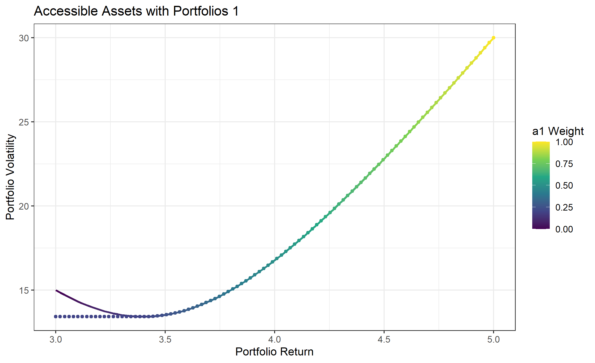
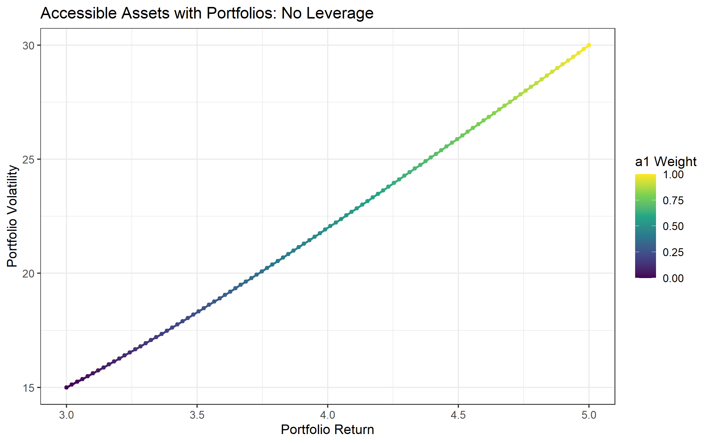
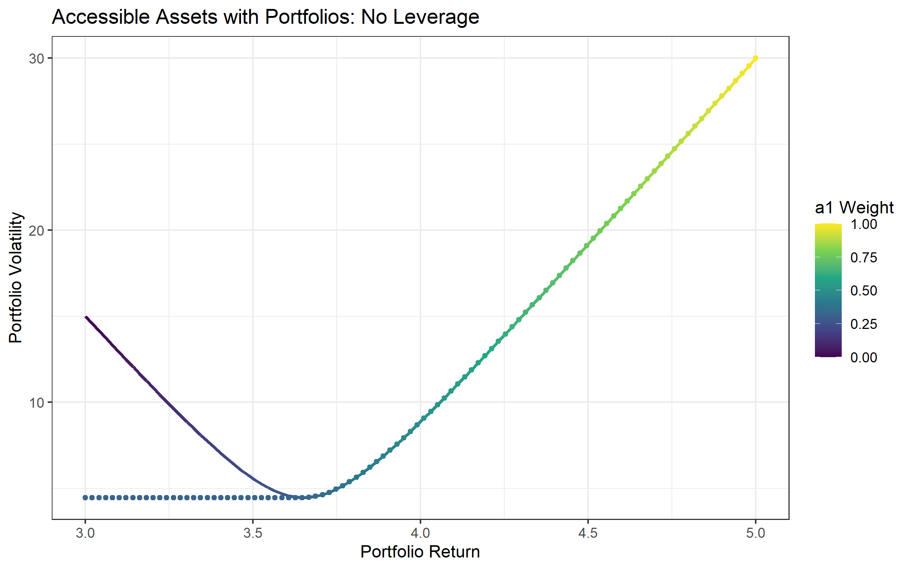
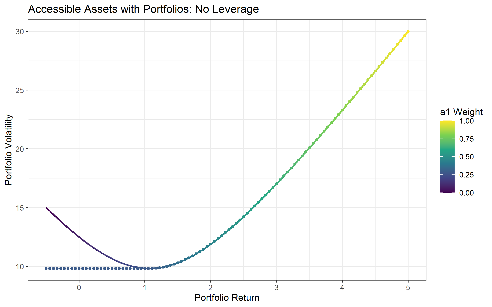

# Summary
* Judge assets on a risk-adjusted basis. Many managers get free press for “significantly beating the market”(20%-30% returns per year), these returns aren’t that special if their performance is a lot more volatile than the market.
* Diversification matters. A well-constructed portfolio can have a similar level return at a lower risk than the individual components of the portfolio.
* Good investing does not require taking bets (e.g. “I think GME will go down” or “I think inflation will go up”). The Mean-Variance approach to investing tells us that we can improve our portfolios even if we believe asset returns are random.

# Definitions and Basic Facts
Here, we will treat assets you are investing in as random variables. Why? Because it is notoriously difficult to know with any precision what a particular stock, bond, etc. will return next year. If you know what the stock market will return next year, you should close this article and open up your own hedge fund.

**Definitions:**
* Expected return means the average return of some asset or portfolio. We denote the expected return of an asset \\(X\\) as \\(E(X)\\)
* Volatility means the standard deviation of some asset or portfolio. We denote the variance of an asset \\(X\\) as \\(\text{Var}(X)\\). The standard deviation is just the square root of the variance. 
* Correlation, between -1 and +1 describes a relationship between two assets. A -1 correlation means there is a perfect *negative* linear relationship, and a +1 correlation means there is a perfect *positive* linear relationship between the two assets. A more negative correlation  means the assets diversify eachother well, because when one goes down the other is more likely to offset by going down.  

**Example 1:**
We can use the above facts to compute expected returns and volatility of a portfolio from their components. Let’s say \\(X\\) are stocks and \\(Y\\) are bonds. Your portfolio is one half stocks and another half bonds.

From historical data, we can compute the below table

| Asset         | Expected Return     | Risk (Standard Deviation) | Ratio | 
|--------------|-----------|------------| ---- |
| American Stocks  | 6%      | 20%        | 0.3 |
| American Bonds      | 2%  | 7%      | 0.23 |
Table 1: Stocks and Bonds

Let's consider 2 cases - 
1. A realistic case - American Stocks and American Bonds historically have a correlation of -0.2  
2. A less realistic case - assume they're much more negatively correlated with a correlation of -0.8 

| Case         | Expected Return     | Risk (Standard Deviation) | Ratio |
|--------------|-----------|------------| --- |
| Case 1 Portfolio | 4%      | 10.6%        | 0.4 |
| Case 2 Portfolio      | 4%  | 10.5%      | 0.4 |
Table 2: Returns and Risks of Simple 50-50 Portfolios

Notice two points:
1. The Case 2 portfolio is strictly better than the case 1 portfolio, although not by much. 
2. Both portfolios have a better risk-return ratio than the assets individually. 

This starts to show the benefits of diversification. By doing a simple combination, you can often get improvements (on a risk-adjusted basis) to the assets you start with.  

# The Importance of Risk Adjustment

Why do we bother with risk adjustment? Here are two reasons:
## Risk aversion

People are generally risk averse, so they must be paid in the form of superior average returns to take it. There are lots of empirical studies in Psychology demonstrating this; take a look at the Wiki Article on [Prospect Theory](https://en.wikipedia.org/wiki/Prospect_theory) for reference.

Another justification for risk aversion is the [St. Petersburg Paradox](https://en.wikipedia.org/wiki/St._Petersburg_paradox). This provides an example of a wager with infinite expected value that nobody would realistically play for billions or trillions of dollars - because we risk losing everything. 

## Borrowing
In markets, return and risk can be scaled up or down with borrowing. Table 4 walks through a calculation with a base portfolio of $100 and borrowing $200 at a 2% interest rate from the bank. The investor invests everything (borrowed and initial) into the same asset that returned 5%.

| Source	| Amount |
| ----------| ------ |
| Portfolio	| $100   |
| Portfolio Return | $5 |
| Borrowing	| $200 |
| Borrowed Return | $10 |
| Repay Bank | -$200 |
| Repay Bank Interest | -$4 |
| Total | $111 |
Table 4a: Amplifying Returns with Borrowing

Since the investment went up 5%, the investor gained on their invested money and the borrowed money. This results in a net gain of 11% on their own money.

It works the other way too, the table looks a quite sad if the asset goes down 5%. 

| Source	| Amount |
| ----------| ------ |
| Portfolio	| $100   |
| Portfolio Return | -$5 |
| Borrowing	| $200 |
| Borrowed Return | -$10 |
| Repay Bank | -$200 |
| Repay Bank Interest | -$4 |
| Total | $81 |
Table 4b: Amplifying Returns with Borrowing

In this way, *if* investors can easily borrow (true for large institutions, less true for you and me) - the expected return of an asset is almost meaningless. We can get any return we want with any asset by just borrowing money and reinvesting that borrowed money.

# The Mean-Variance Approach to Investing
In the stock bond example, we simplistically invested 50-50 and called it a day. In reality, we might choose a better asset-mix if that would give us a better portfolio. 

In the mean-variance approach, there are 2 steps. 
1. Set a level of return we want
2. Choose the portfolio that achieves that return at minimum risk. 

# Diversification

Plots 2 through 5 show the desired level of portfolio return on the X axis and resulting optimal portfolio volatility on the Y axis. The solid line shows the risk/return characteristics of *possible* portfolios, while the dotted line shows the risk/return characteristics of *optimal* portfolios. 

Better portfolios are closer to the bottom right (high return, low volatility). 

Plot Number	| Asset 1 Return | Asset 2 Return | Asset 1 Risk | Asset 2 Risk | Correlation |
| --- | --- | --- | --- | --- | --- |
2 | 5% | 3% | 30% | 15% | 0.0 |
3 | 5% | 3% | 30% | 15% | 0.9 |
4 | 5% | 3% | 30% | 15% | -0.9 | 
5 | 5% | -0.5% | 30% | 15% | -0.9 |

Plot 2: 

In Plot 2, we can see some small benefits to diversification. 
Let's focus on the leftmost point - this means that we *desire* a return of 3.0%. 
There are 2 ways to achieve that return. 
* The solid line shows that we can get 3.0% return by holding 0% of asset 1 and 100%  of asest 2. This gives us a portfolio risk of 15%. 
* The dotted line shows that we can get that 3.0% return by holding 25% of asset 1 and 75% of asset 2. This gives us a strictly better portfolio - it has a higher return (3.5%) and lower volatility (about 12%). 

Geometrically, we can see this because the line of possible portfolios is u-shaped. The downward-sloping part of the U means we can get closer to the bottom right (higher return and lower risk) by increasing the weight of asset 1. 

So, there are a lot of *possible* portfolios in this example that are simply not worth considering - the 0% asset 1 portfolio is one of them. 

Plot 3: 

In example 3, we have two highly correlated assets. Here, there are almost no benefits to diversification. The solid line of possible portfolios essentially coincides with the dotted line of optimal portfolios. This makes sense - because highly correlated assets are basically the same asset.

Plot 4:

In example 4, we have two highly negatively correlated assets. In this plot, we see the same features as in example 2 in a much more pronounced manner. 

Plot 5:

Example 5 shows that there are some benefits to diversification even if one of the assets yields *negative* returns. But, the benefits only arise if you want a small portfolio return. This is why we buy insurance - we generally pay more in premiums than we will cash out on, but we still do so because it sufficiently reduces the risk we take on in life. 

# Limitations of the Mean Variance Approach

If you want to follow the model to the tee to invest your retirement portfolio, you have to know ahead of time the average returns for each stock and all of the covariances. That estimation task (particularly the covariances from time-dependent data) is notoriously difficult that it’s worth an entire research field in statistics and applied math.

Risk-adjusted-return is not as actionable if you don’t have easy sources of borrowing. To increase the return of your portfolio, you would have to bias your portfolio towards stocks and reduce your gains from diversification.

For this reason, I am not automating my stock portfolio using this model but the key lessons are still relevant.

# Appendix - Some Math
**Facts:**
$$E(aX+bY)=aE(X)+bE(Y)$$
$$\text{Var}(aX + bY) = a^2\text{Var}(X) + b^2\text{Var}(Y) + 2ab\text{Cov}(X,Y)$$

**The Mean Variance Model**
$$\min w^2Var(a_1)+(1−w)^2Var(a_2)$$
$$\text{s.t. } wE(a_1) + (1-w) E(a_2) \geq \mu_0$$