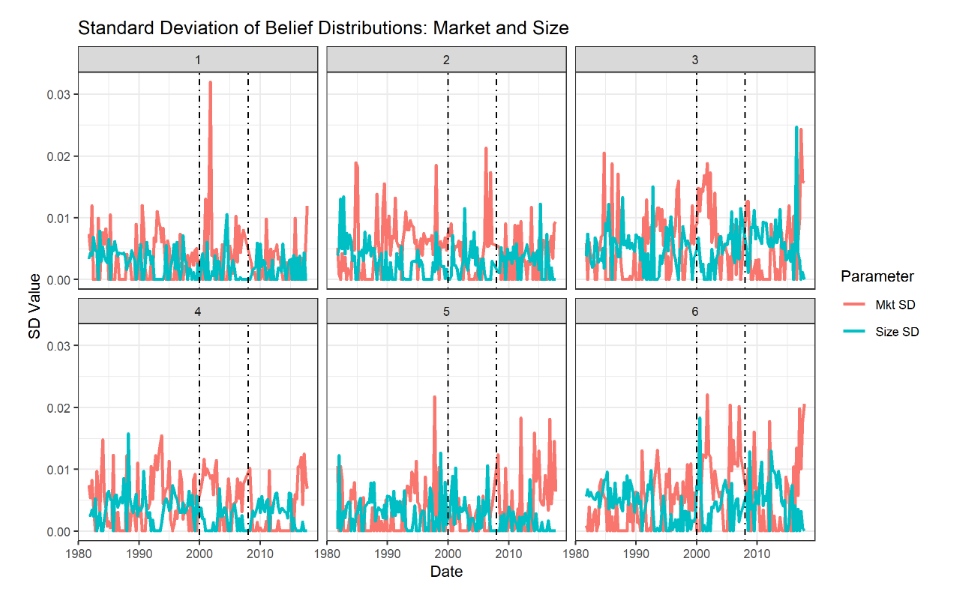

# Summary
In my Bachelor's honors thesis, I find that pessimism and disagreement increase during economic crises, that the average investor predicts returns very poorly, and that the data rejects a belief-driven CAPM model. 

# Paper Assumptions and Procedures
While the prior literature focused on survey data, my paper estimates investor beliefs directly from their investment decisions. 

I start with a dataset on almost all american institutional investor stock holdings. Since it is impractical to recover beliefs about every single stock, I collapse these individual stock holdings into 3 core factors (Market returns, Value returns, and Size returns) that are known to explain equity returns well. 

Assuming that the investors decide in accordance to mean-variance, I can estimate what they believe the mean market return is from how much of the market factor they are holding.  

I get the following 2 plots for the Mean and Standard Deviation of Investor Beliefs 

Plot 1

Plot 2

I interpret the mean belief as what the 'average' investor in the sample thinks the respective factors will return, while the standard deviation of beliefs shows the amount of disagreement around the average that investors have. 

# Pessimism during crises
Plot 1 shows that the Dot Com bubble and 2008 financial crisis (shown by vertical dotted lines) coincided with significant downturns in beliefs about market returns. 
Plot 2 shows that for the same crises, investor disagreement about returns increased.  

# Beliefs don't predict returns
Plot 3

This scatterplot visualizes the average investor's belief about market returns against actual returns. If the average investor was any good at predicting market returns, we would expect the points to closely align to the 45 degree line (dotted line above, where a 1% increase in belief is associated with a 1% increase in the actual market returns). Our estimates show there is basically no relationship between what the average investor believes the market will do and what actually happens.  

# Implications for the CAPM
The classic CAPM model:
$$R_{i,t} = \beta_i m_t + r_{f,t}$$
Where \\(R_{i,t}\\) is the expected return of stock \\(i\\), \\(\beta_i\\) is the exposure of stock \\(i\\) to market risk, \\(m_t\\) is the return of the market portfolio, and \\(r_{f,t}\\) is the risk free rate. 

Predictive weakness in the classic CAPM led one branch of the asset pricing literature to generalize the classic model to include heterogeneous rather than uniform beliefs. By and large, these papers have the same prediction as the classic CAPM but replace the actual market portfolio return with what the average investor believes about the market portfolio return. This model has been tough to test in the past because we had no means of assessing what investors actually believe the market will return. Using the estimates from my paper, we can conduct a novel test of this previously untestable model.  

If the consensus-belief CAPM is any good we would expect \\(\gamma\\) in the following regression to equal 1:
$$R_{i,t} - r_{f,t} = \gamma\[\beta_i m_t\] + e_t$$

Where \\(m_t\\) is what the average investor thinks the market will return at time \\(t\\), \\(R_{i,t}\\) is the actual return of stock \\(i\\), \\(\beta_i\\) is the actual exposure of stock \\(i\\) to market risk, and \\(e_t\\) is the error term. 

Plot 4
 

We plot the \\(\gamma\\) estimates through time along with ther 95% confidence bands, showing that they're basically all over the place and  significantly different from 1. 

This comes from the fact that if the belief-driven CAPM is true, beliefs have to be predictive of actual returns. From plot 3, that doesn't seem to be the case - so our results suggest that the belief-driven CAPM doesn't fit the data. 

# Link to Paper
For a lot more technical details, discussion of limitations, and literature review, you can see my actual paper [here](jasonyang_thesis.pdf)